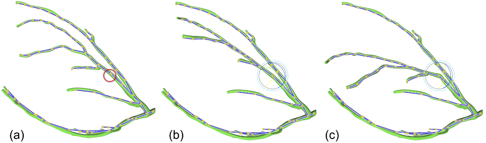
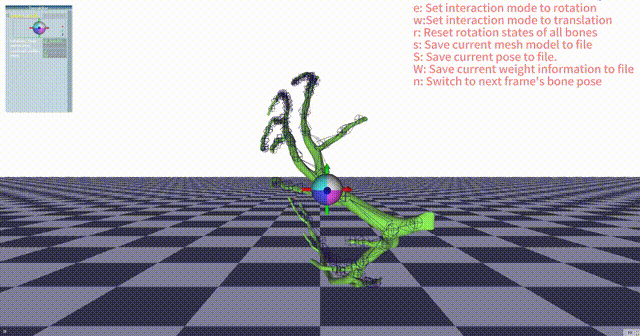

 # Time-Varying Coronary Artery Deformation: A Dynamic Skinning Framework for Surgical Training 

[Shuo Wang](https://orcid.org/0009-0008-6187-0401)<sup>1</sup>,
[Tong Ren](https://orcid.org/0009-0002-1929-8444)<sup>2</sup>,
[Nan Cheng]<sup>2</sup>,
[Rong Wang]<sup>2</sup>,
[Li Zhang](https://orcid.org/0000-0003-3633-9578)<sup>1*</sup>

<sup>1</sup>Tsinghua University, <sup>2</sup>The Six medical center of PLA General Hospital

[[Project](#)] [[Paper](#)] [[arXiv](#)] [[Video](#)] [[Supp](#)]

This repository contains the official implementation of our paper "Time-Varying Coronary Artery Deformation: A Dynamic Skinning Framework for Surgical Training", submitted to International Journal of Computer Assisted Radiology and Surgery.

**Note:** <span style="color: red">The complete code will be released upon paper acceptance.</span>

## Features
<p align="center">
  
</p>
<p align="center">
  
</p>

- Skeleton-based real-time deformation
- Animation sequence playback for vessel deformation
- Interactive skeletal control
- Visualization debugging tools
- Export capabilities for deformed meshes and pose data

## Requirements

### System Requirements
- Windows/Linux/MacOS
- OpenGL support
- C++ compilation environment

### Dependencies
- Eigen 3.3+
- libigl
- GLUT
- AntTweakBar
- CGAL (optional, for mesh processing)
- TetGen (optional, for tetrahedral meshing)

## Installation
```bash
mkdir build
cd build
cmake ..
make
 
 Usage 
 Mouse Controls 
 
 Left Click + Drag: Select and control bones 
 Alt + Left Drag: Rotate scene 
 Mouse Wheel: Zoom in/out 
 
 Keyboard Shortcuts 
 
 A/a: Toggle animation play/pause 
 D/d: Deselect all 
 e: Set rotation control mode 
 w: Set translation control mode 
 R: Reset selected bone rotation 
 r: Reset all bone rotations 
 F/f: Toggle floor display 
 S: Save current posed mesh 
 s: Save current skeleton pose 
 W: Save current weights 
 Z/z: Snap to canonical view 
 Ctrl+Z: Undo 
 Ctrl+Shift+Z: Redo 
 ESC/Ctrl+C: Exit program 
 
 File Formats 
 
 Supported Mesh Formats: .obj, .off 
 Skeleton File Format: .tgf 
 Weight File Format: .dmat 
 Output Formats:
 
 Mesh: .obj 
 Pose: .dmat 
 Weights: .dmat 
 
 
 
 Command Line Arguments 
 ./program <model.obj> <skeleton.tgf> [weights.dmat] [pose-prefix]
 
 Parameters: 
 
 model.obj: Input mesh model file 
 skeleton.tgf: Skeleton file 
 weights.dmat: (optional) Weight file 
 pose-prefix: (optional) Prefix for output pose files 
 
 Important Notes 
 
 Ensure correct format for input models and skeleton files 
 Large models may require longer initialization time 
 Recommended to save weight files to avoid recalculation 
 Adjust model resolution if performance issues occur 
 
 Citation 
 If you find our work useful in your research, please consider citing our paper: 
 # Citation will be available after paper acceptance
 
 Relevant Works 
 Acknowledgement 
 Status:  This is a preliminary release. More features and documentation will be added soon. 

 
 你可以根据个人喜好选择使用哪种突出显示方式。
